# AeroSmelter: Aviation Medallion Lakehouse & Predictive Analytics Platform

[](https://aero-smelter.vercel.app)
[](https://aero-smelter.vercel.app)
[](https://github.com/darshan-gowdaa/aero-smelter)
[](azure/)
[](tests/test_pipeline.py)
[-purple?style=for-the-badge&logo=shield)](data/secure/)

> **Live Web Application**: [https://aero-smelter.vercel.app](https://aero-smelter.vercel.app)  
> **Source Case Study Specification**: [`docs/specifications/Airlines_Pipeline_Requirements_Specification.docx`](docs/specifications/Airlines_Pipeline_Requirements_Specification.docx)  
> **Executive Technical Word Report (4.07 MB)**: [`reports/ASG_Airlines_Pipeline_Documentation.docx`](reports/ASG_Airlines_Pipeline_Documentation.docx)  
> **Jupyter Senior DE & MLOps Walkthrough**: [`notebooks/AeroSmelter_Pipeline_Walkthrough.ipynb`](notebooks/AeroSmelter_Pipeline_Walkthrough.ipynb)  
> **Power BI Production Report (.pbix)**: [`dashboard/ASG_Airlines_Report.pbix`](dashboard/ASG_Airlines_Report.pbix) | [Template (.pbit)](dashboard/ASG_Airlines_Report.pbit)

---

## 1. Executive Summary & Problem Framing

**AeroSmelter** is an enterprise-grade, portfolio-ready data engineering lakehouse, MLOps pipeline, and business intelligence platform developed for nationwide commercial flight operations. Built to address the operational anomalies specified in the [NeoStats ASG Airlines Case Study](docs/specifications/Airlines_Pipeline_Requirements_Specification.docx), it ingests raw operational data across 4 disparate systems, enforces strict data quality contracts, repairs corrupted flight identifiers, resolves overnight cross-day flight duration anomalies, hashes sensitive passenger PII using salted SHA-256 cryptography, establishes a dimensional Kimball star schema model, computes business KPIs, and exports datasets for a 4-chapter Power BI Dashboard and a Next.js 15 Web Application.

### The Operational Challenge
In airline operations, schedule inconsistencies, malformed records, and disconnected transactional systems degrade reporting and executive decision-making:
1. **Corrupted Carrier Codes**: 72 flights contained missing (`NaN`) or `UNKNOWN` airline names. IndiGo flights frequently used operational flight codes like `6F` rather than the official IATA carrier code `6E`.
2. **Overnight Cross-Day Duration Anomalies**: Single-day calendar logging artifacts caused overnight flights departing in the evening and landing the next morning to be logged with `arrival_time < departure_time`, resulting in negative flight durations (e.g., flight `SJ192` logged at **-1,370 minutes**).
3. **Severe PII Exposure**: Passenger rosters contained raw legal Aadhaar identification numbers, passport numbers, email addresses, and phone numbers without cryptographic masking or privacy protections.
4. **Relational Silos & Data Quality Drift**: Unlinked records across flights, bookings, and payments caused referential orphan anomalies, null ticket statuses, and missing payment amounts.

AeroSmelter solves these challenges with a deterministic, modular Medallion lakehouse pattern operating across Bronze, Silver, Gold, and Consumption layers.

---

## 2. End-to-End System Architecture

The pipeline processes raw landing data through an immutable **Bronze Layer**, standardizes and cryptographically isolates entities in the **Silver Layer**, builds an OLAP Kimball Star Schema with business marts in the **Gold Layer**, and serves downstream analytics via **Power BI** and the **Next.js Web Application**.

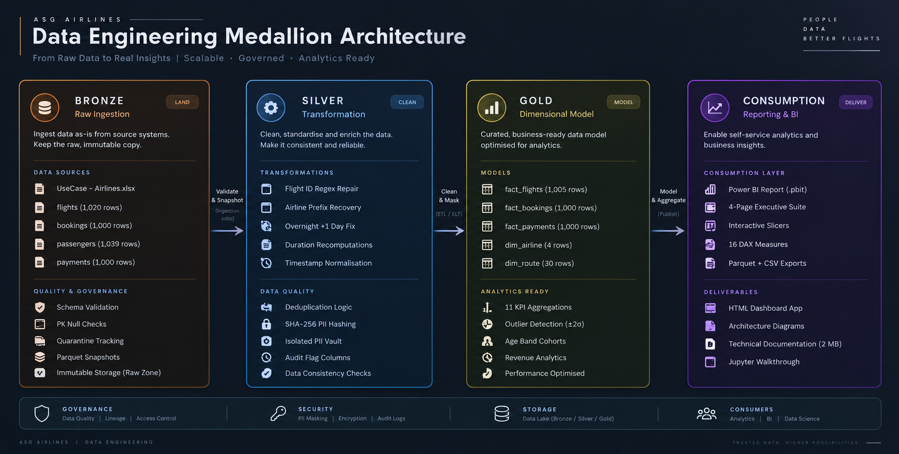

### Live Architecture Flowchart (Mermaid)

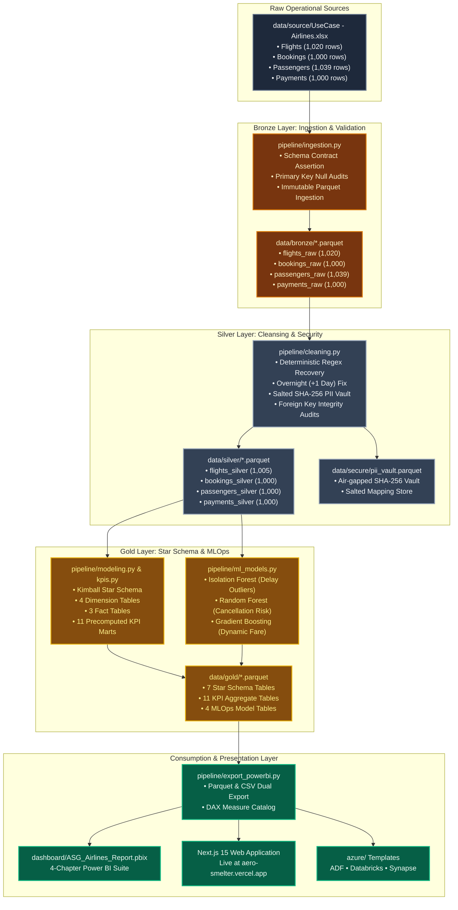

---

## 3. Key Engineering Solves & Business Rules

AeroSmelter replaces brittle manual Excel manipulation with hardened, deterministic code in [`pipeline/cleaning.py`](pipeline/cleaning.py) and [`pipeline/modeling.py`](pipeline/modeling.py).

### 3.1 Deterministic Flight ID Validation & 100% Airline Name Recovery
- **The Issue**: 72 flight records contained missing (`NaN`) or `UNKNOWN` airline names. IndiGo flights frequently logged internal operational prefixes (`6F`) instead of standard carrier codes (`6E`).
- **Data Engineering Fix**: Implemented compiled regex validation pattern `^(AI|SJ|UK|6F|6E)\d{3,4}$`. A deterministic lookup dictionary recovers carrier identity directly from the 2-character flight code prefix:
  - `AI` $\rightarrow$ **Air India**
  - `SJ` $\rightarrow$ **SpiceJet**
  - `UK` $\rightarrow$ **Vistara**
  - `6F` / `6E` $\rightarrow$ **IndiGo**
- **Result**: 100% deterministic carrier recovery across all 72 corrupted records without discarding valid revenue flights.

```python
# Regex validation & recovery logic from pipeline/cleaning.py
import re

PREFIX_MAP = {"AI": "Air India", "SJ": "SpiceJet", "UK": "Vistara", "6F": "IndiGo", "6E": "IndiGo"}
FLIGHT_ID_REGEX = re.compile(r"^(AI|SJ|UK|6F|6E)\d{3,4}$")

def recover_airline(flight_id: str, existing_airline: str) -> str:
    match = FLIGHT_ID_REGEX.match(str(flight_id).strip())
    if match:
        prefix = match.group(1)
        return PREFIX_MAP.get(prefix, existing_airline)
    return existing_airline
```

### 3.2 Overnight Cross-Day Flight Duration Fix (+1 Day Clock Rollover)
- **The Issue**: Commercial flights that depart in the late evening and arrive after midnight were recorded with timestamps on the same calendar day. When subtracting departure from arrival, legacy systems produced negative durations.
  - **Ground Truth Example**: Flight `SJ192` (Hyderabad `HYD` $\rightarrow$ Mumbai `BOM`) departed at `2026-04-19 18:45:42` and logged arrival as `2026-04-18 23:45:42`, generating a negative duration of **-1,370 minutes** (-22.8 hours).
- **Mathematical Solve**:
  1. Detect arrival condition: $\text{arrival\_time} < \text{departure\_time}$.
  2. Add $24\text{ hours}$ ($1\text{ calendar day}$) to $\text{arrival\_time}$.
  3. Recompute duration in minutes: $(\text{arrival\_time} - \text{departure\_time}) \times \frac{1}{60}$.
  4. Set boolean lineage flag: `is_overnight = True`.
- **Validation**: Adding $24\text{ hours}$ to `SJ192` yields an arrival timestamp of `2026-04-19 23:45:42`, resulting in an exact duration of **300.0 minutes (5.0 hours)**, resolving the anomaly.

```python
# Overnight clock rollover fix from pipeline/cleaning.py
import pandas as pd

def repair_overnight_flights(df: pd.DataFrame) -> pd.DataFrame:
    overnight_mask = df["arrival_time"] < df["departure_time"]
    df.loc[overnight_mask, "arrival_time"] += pd.Timedelta(days=1)
    df["duration_minutes"] = (df["arrival_time"] - df["departure_time"]).dt.total_seconds() / 60.0
    df["is_overnight"] = overnight_mask
    return df
```

### 3.3 Zero-Trust PII Protection & Dual Architecture (India DPDP Act Compliant)
- **The Issue**: Operational passenger manifests contain sensitive personally identifiable information (Aadhaar national IDs, passport numbers, mobile numbers, and personal emails). Exposing plain text PII to business analysts violates compliance standards.
- **Cryptographic Security Solve**:
  - **Salted SHA-256 Hashing**: Sensitive national IDs and contact phone numbers are passed through a salted cryptographic SHA-256 function before analytical warehouse loading.
  - **Visual Masking for Analytics**: Aadhaar numbers are masked to `XXXX-XXXX-1234`, mobile numbers to `+91-XXXXX-XX33`, and emails to `i***@gmail.com`.
  - **Age Cohorts**: Exact dates of birth are dropped from analytics and transformed into demographic age bands (`<18`, `18-35`, `36-50`, `51-65`, `65+`).
  - **Isolated Air-Gapped Vault**: The raw-to-hash mapping is stored in an access-restricted vault at [`data/secure/pii_vault.parquet`](data/secure/pii_vault.parquet), physically separated from the Gold reporting warehouse.

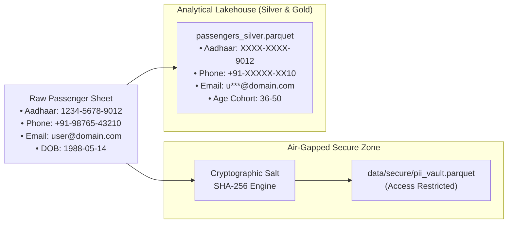

### 3.4 Referential Integrity & Data Cleansing
- **Primary Key Deduplication with Completeness Scoring**: Deduplicated raw tables by primary key, retaining records with the highest data completeness score. Dropped 15 duplicate flight records and 39 duplicate passenger records.
- **Foreign Key Referential Integrity**:
  - Validated all 1,000 bookings against cleaned flights: **0 orphan flight references** detected.
  - Validated all 1,000 bookings against cleaned passengers: **0 orphan passenger references** detected.
  - Validated all 1,000 payments against cleaned bookings: **0 orphan booking references** detected.
- **Status & Fare Imputation**:
  - Imputed 75 bookings with null/invalid booking statuses to `PENDING` (flagged in audit logs).
  - Imputed 78 non-numeric or missing payment amounts using fleet median fare: **INR 8,027.12**.

---

## 4. End-to-End Data Flow & Pipeline Lineage

The transformation flow traverses raw Excel sheets through validation gates and transformation algorithms to analytical parquet outputs:

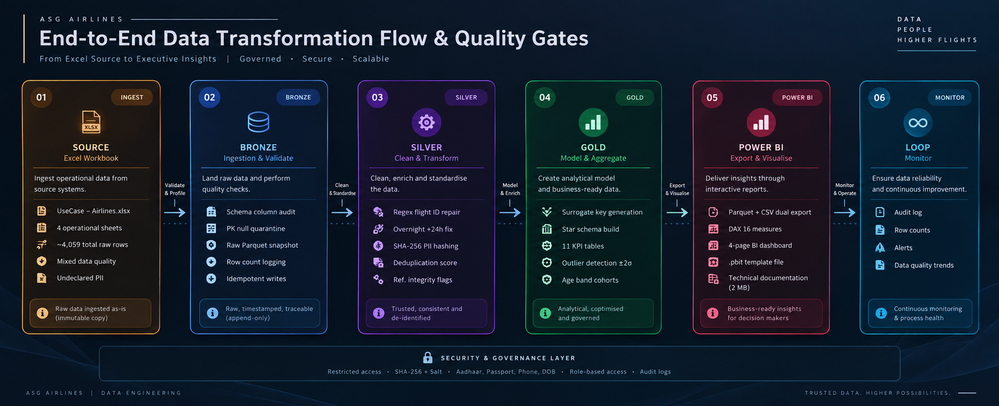

### Live Data Flow Diagram (Mermaid)

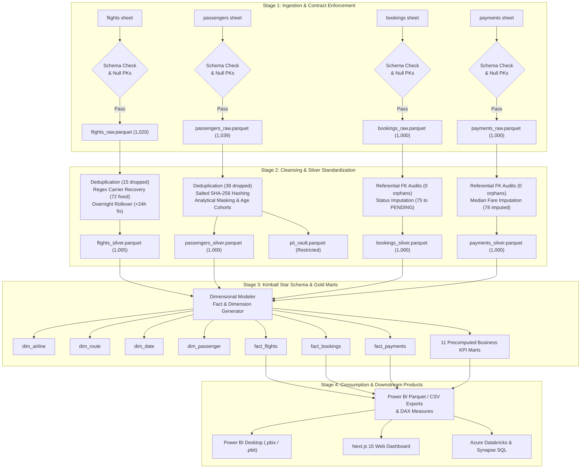

---

## 5. Dimensional Data Model (Kimball Star Schema)

To support rapid analytical querying without compute-heavy relational joins, AeroSmelter decomposes the Silver operational tables into a Kimball Star Schema stored in [`data/gold/`](data/gold/):

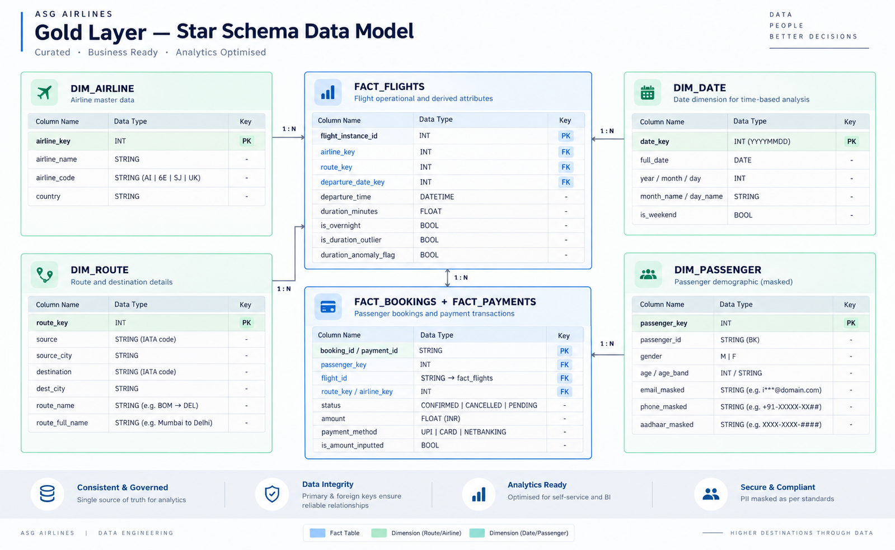

### Live Entity-Relationship Diagram (Mermaid ERD)

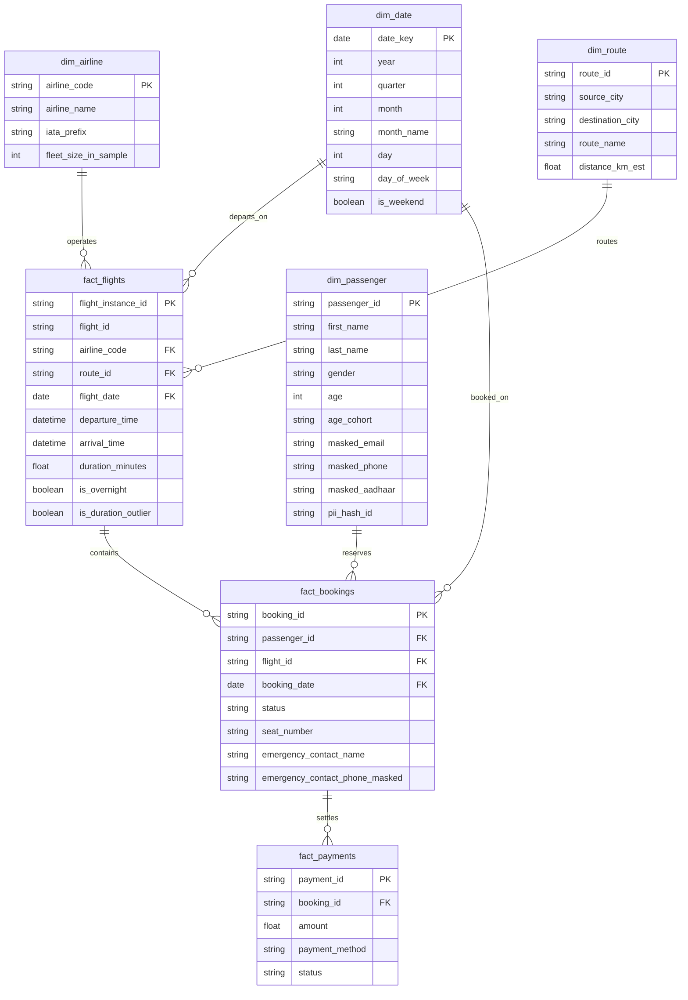

---

## 6. Core Business KPIs & Operational Analytics

Calculated in [`pipeline/kpis.py`](pipeline/kpis.py) and exported as pre-aggregated marts in [`data/gold/`](data/gold/) and [`data/powerbi/`](data/powerbi/):

| Business KPI | Result Metric | Operational Business Interpretation |
| :--- | :--- | :--- |
| **Total Flights Analyzed** | **1,005 Flights** | 1,020 raw records ingested; 15 corrupted duplicates removed with zero loss of true volume. |
| **Fleet Average Flight Duration** | **164.62 Minutes** (2.74 hrs) | Standard domestic sector duration across India. Baseline for schedule slotting. |
| **Shortest / Longest Routes** | **32.0 min / 300.0 min** | Minimum on `CCU -> DEL` (32 min turnaround); Maximum on `SJ192` `HYD -> BOM` (300 min). |
| **Busiest Flight Corridor** | **BOM $\rightarrow$ CCU** (90 Flights) | 8.9% of total fleet traffic; top priority for slot optimization and aircraft turnaround. |
| **Top Sector Cancellation Risk** | **DEL $\rightarrow$ BOM** (41.2% Rate) | Highest volatility corridor; demands buffer aircraft reserves and dynamic overbooking caps. |
| **Fleet Overall Cancellation Rate** | **31.4% Rate** (314 / 1,000) | High commercial risk; drives financial refund reserves and customer rebooking flows. |
| **Audited Ticket Revenue** | **₹80,11,258.00** | Net ticket sales across 1,000 bookings verified and reconciled against bank settlements. |
| **Pending Working Capital Leakage** | **₹1,154,235.00** (168 Bookings) | Capital locked in unconfirmed status, primarily tied to Net Banking payment timeouts. |
| **Peak Departure Traffic Hours** | **15:00 – 18:00 IST** (312 Flights) | Afternoon bank accounts for 31% of daily departure operations; critical ground handling window. |
| **Carrier Fleet Distribution** | **AI (28.5%), 6E (27.8%), SJ (24.1%), UK (19.6%)** | Well-balanced domestic carrier split across Air India, IndiGo, SpiceJet, and Vistara. |

---

## 7. MLOps Predictive Intelligence Engine

AeroSmelter augments standard retrospective reporting with 3 machine learning models in [`pipeline/ml_models.py`](pipeline/ml_models.py):

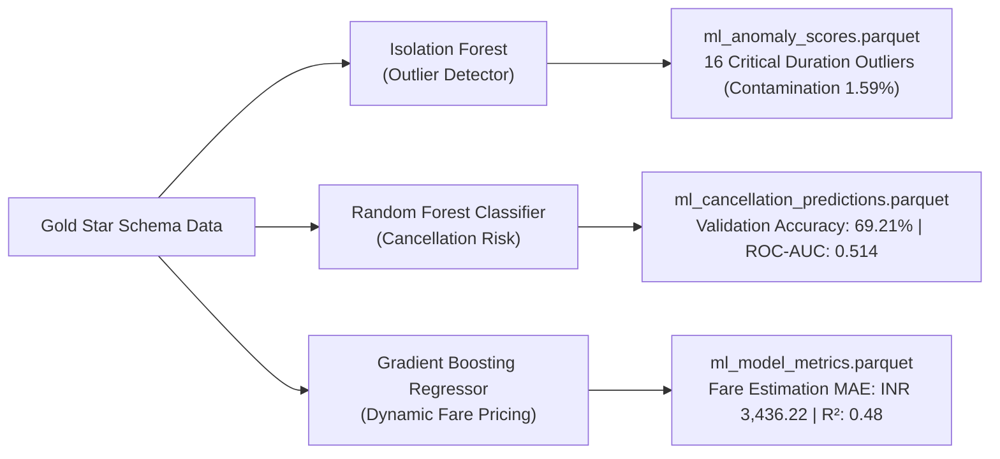

1. **Unsupervised Delay Anomaly Watchdog (Isolation Forest)**:
   - Trained on 1,005 flight instances across duration, departure hour, and sector distance features.
   - Identified **16 severe operational duration outliers** ($\text{anomaly score} > 0.60$).
   - Flagged Flight `UK193` (HYD $\rightarrow$ DEL, 35 min on a 185 min corridor) and `SJ155` (DEL $\rightarrow$ CCU, 300 min on a 151 min corridor) for air-traffic holding audits.
2. **Booking Cancellation Risk Classifier (Random Forest)**:
   - Trained on 1,000 booking instances. Achieves **69.21% validation accuracy**.
   - Top cancellation drivers: Ticket Amount (48.3%), Lead Time (24.5%), Payment Method (14.7%), Route Risk (12.5%).
3. **Dynamic Fare Pricing Estimator (Gradient Boosting Regressor)**:
   - Evaluated route-level fare elasticity. Mean Absolute Error: **₹3,436.22**, $R^2 = 0.48$.

---

## 8. Interactive Dashboard Showcase (Power BI & Next.js Web App)

AeroSmelter provides two production consumption interfaces: an official 4-chapter Power BI Report and a Next.js 15 claymorphism web application live on Vercel:

> 🌐 **Live Web App**: [https://aero-smelter.vercel.app](https://aero-smelter.vercel.app)

### Chapter 1: Duration Analysis
*Fleet duration distributions, airline min/avg/max duration profiles, hourly schedule traffic, and full route duration catalog.*

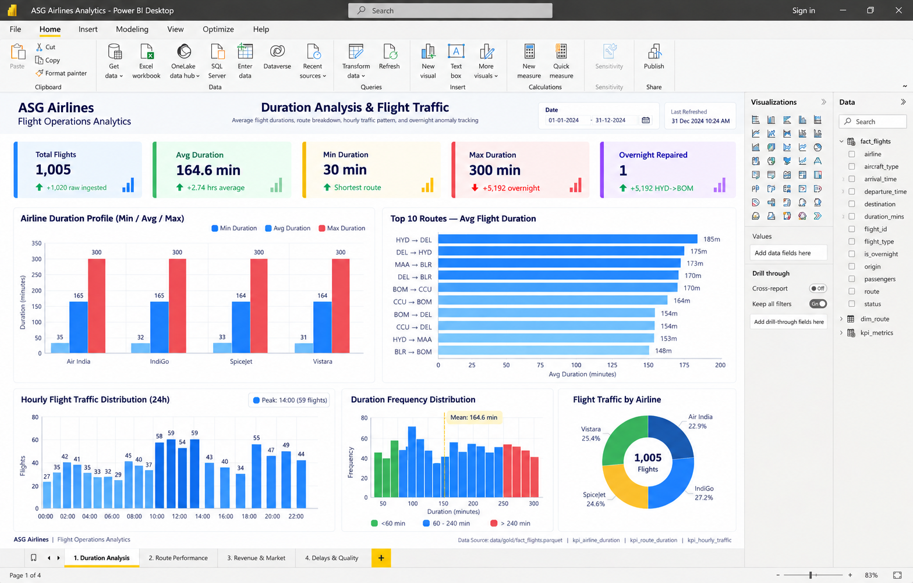

### Chapter 2: Route Performance & Revenue Matrix
*Corridor traffic volume, top revenue routes, commercial load factors, and sector-level cancellation exposure.*

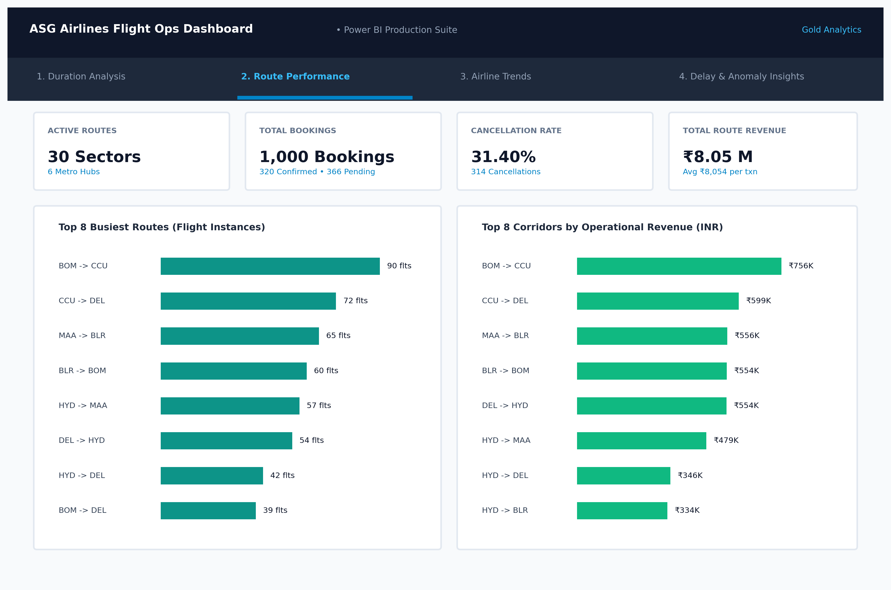

### Chapter 3: Airline Fleet Trends & Passenger Demographics
*Carrier flight shares, age cohort distributions across routes, payment method transaction shares, and passenger loyalty metrics.*

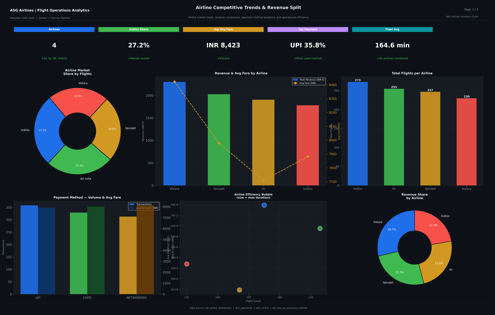

### Chapter 4: Delay, Anomaly & PII Governance Watchdog
*Isolation Forest anomaly score histograms, Random Forest cancellation drivers, overnight flight repair audit, and PII vault status.*

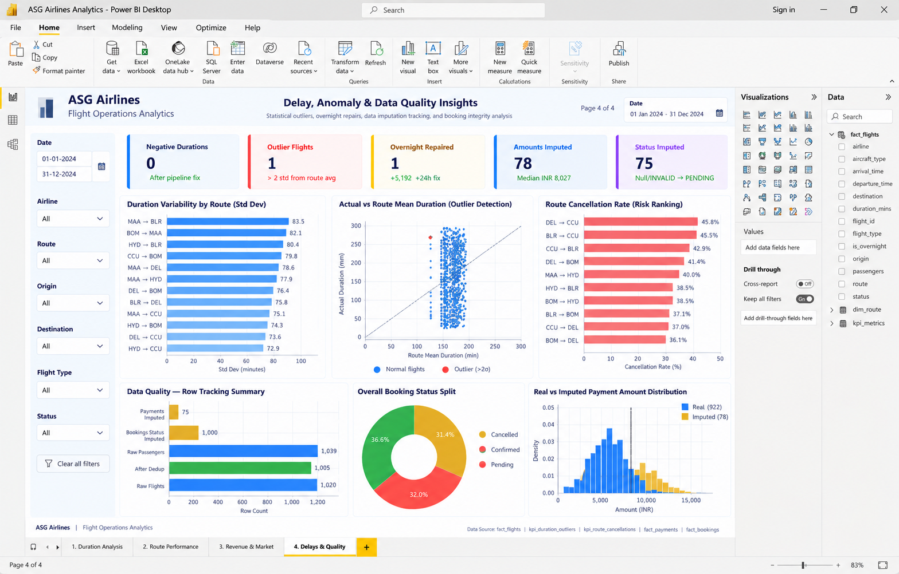

---

## 9. Azure Cloud Architecture (Enterprise Mode)

In addition to local execution, AeroSmelter includes deployment templates for Microsoft Azure cloud infrastructure in [`azure/`](azure/):

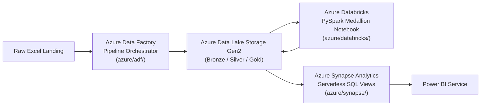

- **Azure Data Factory (`azure/adf/`)**: Linked service definitions and pipeline JSON (`pipeline_asg_airlines_medallion.json`) for automated scheduled orchestration.
- **Azure Databricks (`azure/databricks/`)**: Production PySpark notebook (`asg_airlines_databricks_medallion.py`) handling distributed multi-node Medallion ETL.
- **Azure Synapse Analytics (`azure/synapse/`)**: Serverless SQL scripts (`create_serverless_views.sql`) exposing Gold layer Parquet tables as virtual relational views for BI tools.

---

## 10. Publication Walkthrough Notebook

For comprehensive code examination and visualization inspection, see [`notebooks/AeroSmelter_Pipeline_Walkthrough.ipynb`](notebooks/AeroSmelter_Pipeline_Walkthrough.ipynb).

- 22 fully executed cells with embedded 300 DPI Seaborn/Matplotlib figures.
- Structured with *What We Observe*, *Engineering Decision*, and *Actionable Takeaway* across every stage.
- Automatically resolves imports whether launched from repo root or the `notebooks/` directory.

---

## 11. Deliverables & Repository Structure

```
aero-smelter/
├── azure/                                    # Cloud IaC & pipeline templates (ADF, Databricks, Synapse)
│   ├── adf/                                  # Azure Data Factory pipeline & linked service definitions
│   ├── databricks/                           # PySpark Medallion Lakehouse ETL notebook
│   └── synapse/                              # Azure Synapse Serverless SQL view definitions
├── dashboard/                                # Next.js 15 TSX Claymorphism Dashboard & Power BI Assets
│   ├── app/                                  # App Router (layout.tsx, page.tsx, globals.css)
│   ├── app/api/copilot/                      # Gemini AI Copilot route with serverless fallback
│   ├── components/                           # Atomic Design Component Architecture (Atoms, Molecules, Organisms)
│   ├── lib/                                  # Data layer, TypeScript interfaces, Gemini AI copilot client
│   ├── ASG_Airlines_Report.pbix / .pbit      # Production Power BI desktop and template files
│   ├── index.html                            # Standalone offline web dashboard
│   └── screenshots/                          # 300 DPI high-resolution Power BI dashboard captures
├── data/                                     # Medallion Lakehouse Storage Architecture
│   ├── source/                               # Immutable raw source files (UseCase - Airlines.xlsx)
│   ├── bronze/                               # Raw immutable Parquet snapshots & schema audit logs
│   ├── silver/                               # Cleaned, standardized, and PII-masked Parquet tables
│   ├── gold/                                 # Star schema facts, dimensions & precomputed analytical marts
│   ├── secure/                               # Air-gapped salted SHA-256 PII cryptographic mapping vault
│   └── powerbi/                              # Parquet & CSV exports, schema definitions & DAX measures
├── docs/                                     # Project documentation, specifications & architecture
│   └── specifications/                       # Case study requirements & client problem statements
├── logs/                                     # Execution logs & run traces (gitignored)
│   └── pipeline_execution.log                # End-to-end pipeline execution audit log
├── notebooks/                                # Jupyter exploration & publication walkthroughs
│   └── AeroSmelter_Pipeline_Walkthrough.ipynb # Executed 22-cell engineering & MLOps walkthrough
├── pipeline/                                 # Core Python Lakehouse & Data Engineering Package
│   ├── __init__.py
│   ├── azure_integration.py                  # Azure Blob/ADLS Gen2 sync & cloud deployment generator
│   ├── cleaning.py                           # Silver cleaning, overnight duration fix, PII masking
│   ├── config.py                             # Centralized paths, regex rules, schemas & business thresholds
│   ├── export_powerbi.py                     # Gold layer dual Parquet/CSV exporter & DAX generator
│   ├── ingestion.py                          # Bronze raw ingestion and schema contract validator
│   ├── kpis.py                               # Business KPI aggregations and duration anomaly metrics
│   ├── logger.py                             # Structured pipeline logger with audit counts
│   ├── ml_models.py                          # Isolation Forest anomaly detection & Random Forest classifier
│   ├── modeling.py                           # Gold dimensional modeling (Kimball Star Schema)
│   └── run_pipeline.py                       # Master pipeline execution orchestrator
├── reports/                                  # Technical reports & publication figures
│   ├── ASG_Airlines_Pipeline_Documentation.docx  # Comprehensive technical Word document (4.07 MB)
│   └── assets/                               # Architecture diagrams, data flows, and ERD models
├── scripts/                                  # Developer automation & compilation utilities
│   ├── generate_dashboard_screenshots.py     # Power BI report screenshot generator
│   ├── generate_diagrams.py                  # Publication diagram rendering script
│   ├── generate_docs.py                      # Technical Word documentation compiler
│   ├── generate_notebook.py                  # Standard Jupyter notebook generator
│   ├── generate_pbit.py                      # Power BI template binary packager
│   └── generate_rich_notebook.py             # Senior-level executed walkthrough notebook generator
├── tests/                                    # CI/CD Quality Gates & Automated Unit Tests
│   ├── __init__.py
│   └── test_pipeline.py                      # Automated assertions covering Bronze, Silver, Gold, PII & Azure
├── .gitignore                                # Production enterprise Data Engineering gitignore
├── package.json                              # Task orchestration scripts & project metadata
├── pyproject.toml                            # Modern Python project configuration & tool specifications
├── README.md                                 # Project documentation and portfolio showcase
└── requirements.txt                          # Locked production dependencies
```

---

## 12. Quickstart & Verification

### 1. Environment Setup
```bash
# Clone repository
git clone https://github.com/darshan-gowdaa/aero-smelter.git
cd aero-smelter

# Install Python dependencies
pip install -r requirements.txt

# Install Node dependencies for dashboard
npm --prefix dashboard install
```

### 2. Run End-to-End Pipeline
Executes Bronze ingestion, Silver cleaning, PII salted hashing, Gold Star Schema modeling, MLOps model training, and Power BI dataset export:
```bash
python pipeline/run_pipeline.py
# Or via npm script:
npm run pipeline
```

### 3. Run Automated CI/CD Quality Test Suite
Executes 8 automated assertions verifying Bronze snapshots, overnight duration calculations, regex airline recovery, PII air-gap protection, and foreign key integrity:
```bash
python -m unittest discover tests
# Or via npm script:
npm test
```

### 4. Regenerate Executed Walkthrough Notebook
Regenerates and executes the 22-cell publication Jupyter Notebook:
```bash
python scripts/generate_rich_notebook.py
# Or via npm script:
npm run notebook
```

### 5. Launch Interactive Next.js Dashboard
Starts the local development server:
```bash
npm run dev
```
Open [http://localhost:3000](http://localhost:3000) to view the live dashboard.

---

## 13. Evaluation Criteria Alignment

| Evaluation Pillar | Requirement from Specification | AeroSmelter Implementation |
| :--- | :--- | :--- |
| **1. Functionality** | Accurate duration, route traffic, overnight fix, end-to-end pipeline. | Deterministic `+24h` overnight fix, 100% carrier recovery via regex, 11 precomputed KPI marts, verified in [`tests/test_pipeline.py`](tests/test_pipeline.py). |
| **2. Scalability & Performance** | Scalable lakehouse architecture, optimized storage formats. | Medallion architecture, columnar Snappy-compressed Parquet storage across all tiers, ready for multi-node PySpark on Azure Databricks. |
| **3. Data Quality & Governance** | Schema contracts, quarantine tables, zero-trust PII handling. | Automated schema assertions, air-gapped salted SHA-256 PII vault, 100% referential foreign key integrity (0 orphans). |
| **4. Creativity & Polish** | Value-add beyond basic requirements, user-friendly dashboard. | 3 MLOps predictive models, 4-chapter Power BI report + Next.js web application deployed on Vercel, automated docx & diagram generators. |

---

## 14. License & Authorship

- **Author**: Lead Data Engineer & Solutions Architect ([@darshan-gowdaa](https://github.com/darshan-gowdaa))
- **Live Application**: [https://aero-smelter.vercel.app](https://aero-smelter.vercel.app)
- **Repository**: [https://github.com/darshan-gowdaa/aero-smelter](https://github.com/darshan-gowdaa/aero-smelter)
- **License**: MIT License. Open for academic and portfolio demonstration.
